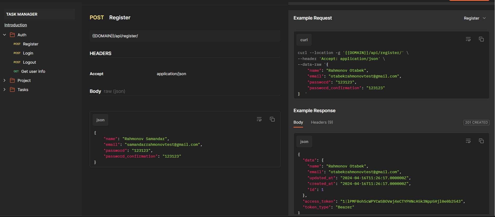
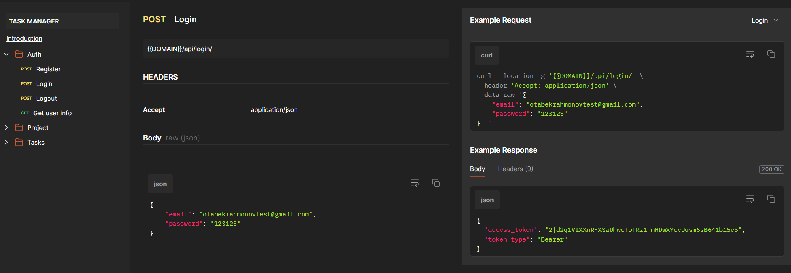
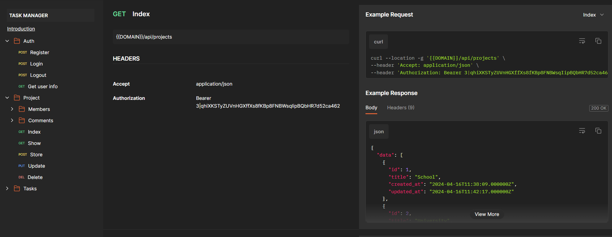

# Backend API for Task manager app!
A task manager, also known as a task management tool or application, is a software program or system designed 
to help individuals or teams organize, prioritize, track, and complete tasks and projects efficiently.

## [API documentation in Postman](https://documenter.getpostman.com/view/22425394/2sA3BkbsgP#ee41b73c-9eb6-4b6b-a419-92e05074ab84) 

### Tech & Tools
    

### Functional

- User registration and login
- Create a project
- Able to add tasks to the project
- Able to add members to the project 
- The ability to filter tasks
- Leave a review for the project 

### Database schema

### API documentation examples
##### Register route:
 

##### Login route:
 

##### Projects index route:
 

